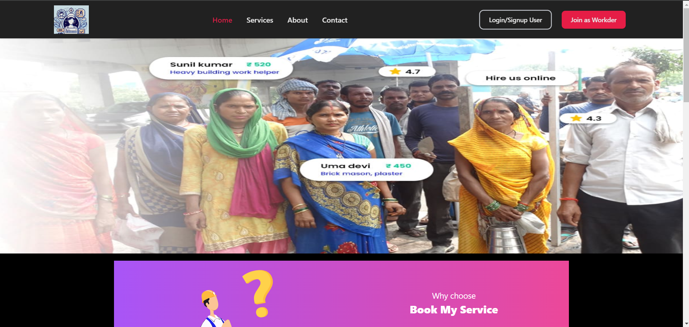
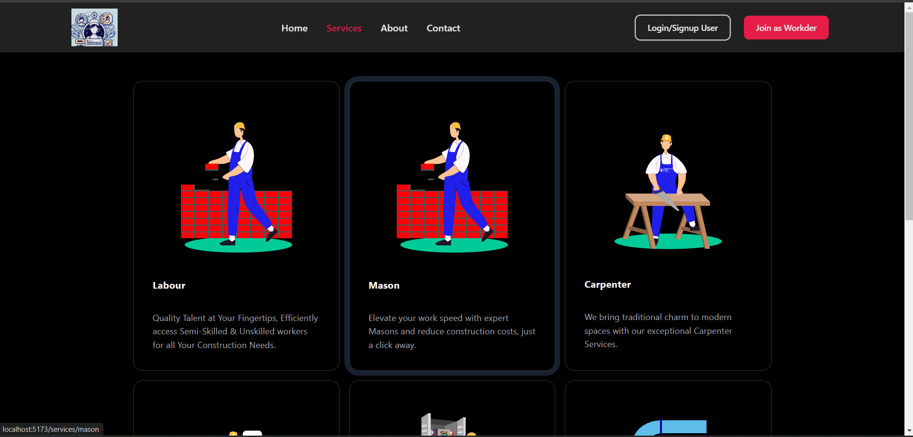
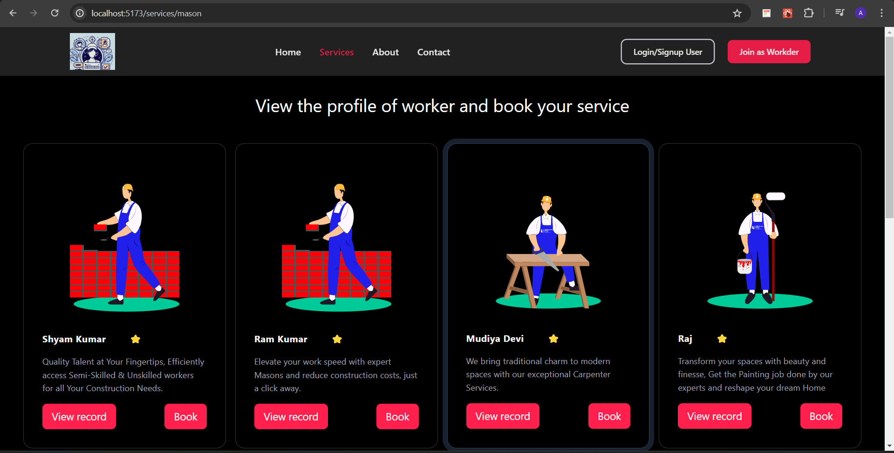

# BOOKMYSERVICE

A Web-Application for booking home and office services with real-time interaction with workers

- Frontend:
  <ul>
    <li> ReactJS (framework)</li>
    <li> JavaScript(language)</li>
     <li>Aceternity UI</li>

  </ul>

Some glimpse of application

<br>

<br>



<h3>Use Manual</h3>
<ul>
<li>Just clone the ropositry </li>
  <li> Initialize npm using</li>
</ul>

```
     npm i  
```
